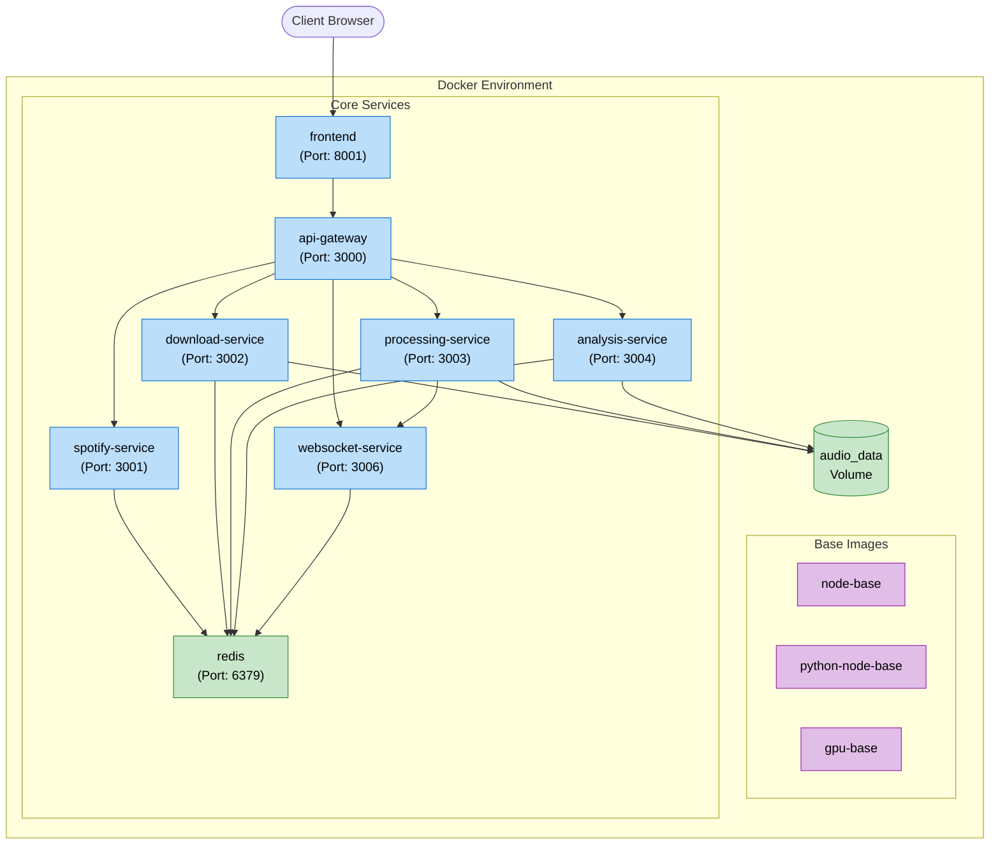
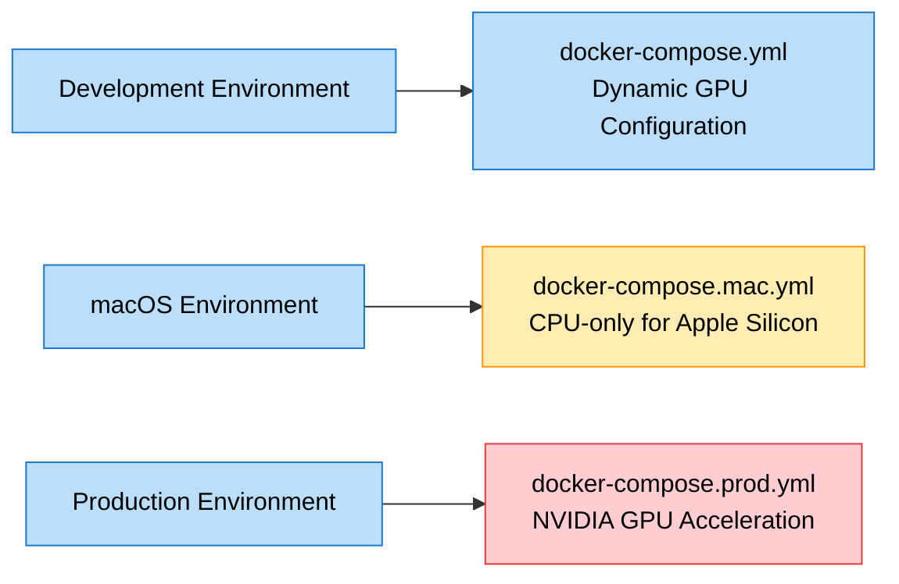
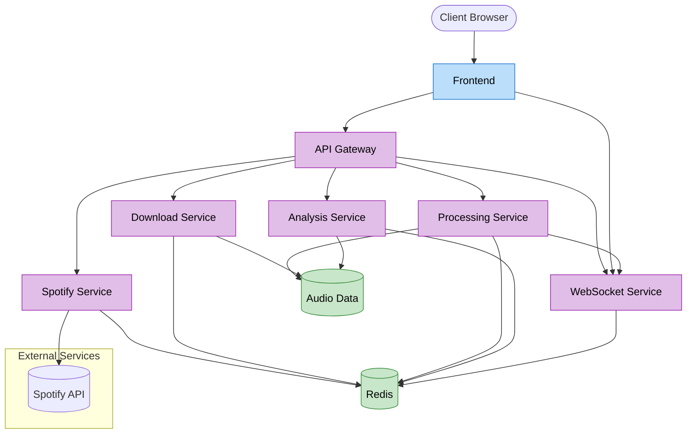

# Sound Forge Alchemy - Docker Architecture

This document provides a comprehensive explanation of the Docker architecture used in the Sound Forge Alchemy project, which is designed to process and analyze audio files with advanced AI capabilities.

## Table of Contents

- [Sound Forge Alchemy - Docker Architecture](#sound-forge-alchemy---docker-architecture)
  - [Table of Contents](#table-of-contents)
  - [Overview](#overview)
  - [Environment-Specific Configurations](#environment-specific-configurations)
    - [Default Configuration](#default-configuration)
    - [Mac Configuration](#mac-configuration)
    - [Production Configuration](#production-configuration)
  - [Service Architecture](#service-architecture)
  - [Base Images](#base-images)
    - [node-base](#node-base)
    - [python-node-base](#python-node-base)
    - [gpu-base](#gpu-base)
  - [Core Services](#core-services)
    - [API Gateway](#api-gateway)
    - [Frontend](#frontend)
    - [Spotify Service](#spotify-service)
    - [Download Service](#download-service)
    - [Processing Service](#processing-service)
    - [Analysis Service](#analysis-service)
    - [WebSocket Service](#websocket-service)
    - [Redis](#redis)
  - [Data Flow](#data-flow)
  - [Networks and Volumes](#networks-and-volumes)
    - [Networks](#networks)
    - [Volumes](#volumes)
  - [Deployment Instructions](#deployment-instructions)
    - [Prerequisites](#prerequisites)
    - [Setting Up the Network](#setting-up-the-network)
    - [Development Environment](#development-environment)
    - [macOS Environment (Apple Silicon)](#macos-environment-apple-silicon)
    - [Production Environment](#production-environment)
  - [Troubleshooting](#troubleshooting)
    - [Common Issues](#common-issues)

## Overview

<a id="overview"></a>

Sound Forge Alchemy is a microservices-based application designed for audio processing and analysis, particularly focusing on stem separation with AI models like Demucs. The Docker architecture is designed to be flexible and run in different environments:

1. **Development environment** - Standard configuration with optional GPU acceleration
2. **macOS environment** - Optimized for Apple Silicon with CPU-only processing
3. **Production environment** - Configured for cloud deployment with NVIDIA GPU acceleration



## Environment-Specific Configurations

<a id="environment-specific-configurations"></a>

The project includes three main Docker Compose configurations:

1. **docker-compose.yml** - The default configuration with dynamic GPU setup
2. **docker-compose.mac.yml** - Optimized for macOS/Apple Silicon with CPU-only processing
3. **docker-compose.prod.yml** - Production configuration with NVIDIA GPU acceleration



### Default Configuration

<a id="default-configuration"></a>

The default configuration (`docker-compose.yml`) uses environment variables to dynamically configure GPU usage:

- `USE_GPU` - Controls GPU usage in the processing service
- `GPU_DRIVER` - Specifies the GPU driver (defaults to "none")
- `GPU_COUNT` - Specifies the number of GPUs to use (defaults to 0)
- `GPU_CAPABILITIES` - Specifies GPU capabilities

### Mac Configuration

<a id="mac-configuration"></a>

The macOS configuration (`docker-compose.mac.yml`) is streamlined for Apple Silicon:

- Uses a CPU-only PyTorch image for the processing service
- Explicitly disables GPU usage
- Only includes essential services for local development
- Container names are explicitly defined for easier identification

### Production Configuration

<a id="prod-configuration"></a>

The production configuration (`docker-compose.prod.yml`) is optimized for cloud deployment:

- Uses NVIDIA GPU acceleration for the processing service
- Explicitly enables GPU usage
- Configures the NVIDIA driver with GPU capabilities
- Version 3.9 Docker Compose specification for advanced features

## Service Architecture

<a id="service-architecture"></a>

The application follows a microservices architecture pattern with the following key components:



## Base Images

<a id="base-images"></a>

The project uses three base images as foundations for the various services:

### node-base

<a id="node-base"></a>

The `node-base` image provides a Node.js runtime environment:

- Built from `Dockerfile.node-base`
- Used as a base for Node.js services (API Gateway, Frontend, WebSocket Service, etc.)

### python-node-base

<a id="python-node-base"></a>

The `python-node-base` image provides both Python and Node.js runtime environments:

- Built from `Dockerfile.python-node-base`
- Used as a base for services that require both Python and Node.js (Download Service, Analysis Service)

### gpu-base

<a id="gpu-base"></a>

The `gpu-base` image provides a GPU-accelerated environment:

- Built from `Dockerfile.gpu-base`
- Used as a base for the Processing Service in GPU mode
- Configured with CUDA and PyTorch for AI model acceleration

## Core Services

<a id="core-services"></a>

### API Gateway

<a id="api-gateway"></a>

The API Gateway serves as the entry point for all client requests:

- **Port**: 3000
- **Dependencies**: All other services
- **Key Responsibilities**:
  - Route requests to appropriate services
  - Handle authentication/authorization
  - Provide a unified API for the frontend
- **Environment Variables**:
  - Service URLs for all downstream services
  - Supabase credentials for authentication
  - Redis URL for caching and messaging

### Frontend

<a id="frontend"></a>

The Frontend service provides the user interface:

- **Port**: 8001
- **Dependencies**: API Gateway
- **Key Responsibilities**:
  - Serve the web application UI
  - Handle user interactions
  - Communicate with API Gateway
  - Establish WebSocket connections for real-time updates
- **Environment Variables**:
  - API Gateway URL
  - WebSocket Service URL

### Spotify Service

<a id="spotify-service"></a>

The Spotify Service handles interactions with the Spotify API:

- **Port**: 3001
- **Dependencies**: Redis
- **Key Responsibilities**:
  - Authenticate with Spotify API
  - Search for tracks
  - Fetch track metadata
  - Cache responses in Redis
- **Environment Variables**:
  - Spotify API credentials
  - Redis URL

### Download Service

<a id="download-service"></a>

The Download Service handles downloading audio tracks:

- **Port**: 3002
- **Dependencies**: Redis
- **Key Responsibilities**:
  - Download audio tracks using spotdl
  - Store downloaded files in the audio_data volume
  - Update progress through Redis
- **Environment Variables**:
  - Redis URL
  - Audio data path
- **Volumes**:
  - audio_data: Used to store downloaded audio files

### Processing Service

<a id="processing-service"></a>

The Processing Service handles audio separation with Demucs:

- **Port**: 3003
- **Dependencies**: Redis, WebSocket Service
- **Key Responsibilities**:
  - Separate audio tracks into stems (vocals, bass, drums, etc.)
  - Process audio with AI models
  - Use GPU acceleration when available
  - Report processing progress via WebSocket
- **Environment Variables**:
  - Redis URL
  - Audio data path
  - WebSocket Service URL
  - USE_GPU flag
- **Volumes**:
  - audio_data: Used to read source and write processed audio files
- **GPU Configuration**:
  - Dynamic GPU usage based on environment
  - Production: NVIDIA GPU acceleration
  - macOS: CPU-only processing

### Analysis Service

<a id="analysis-service"></a>

The Analysis Service handles audio analysis:

- **Port**: 3004
- **Dependencies**: Redis
- **Key Responsibilities**:
  - Analyze audio characteristics (BPM, key, etc.)
  - Process audio metadata
  - Store analysis results
- **Environment Variables**:
  - Redis URL
  - Audio data path
- **Volumes**:
  - audio_data: Used to read audio files for analysis

### WebSocket Service

<a id="websocket-service"></a>

The WebSocket Service provides real-time communication:

- **Port**: 3006
- **Dependencies**: Redis
- **Key Responsibilities**:
  - Handle real-time communication between services and frontend
  - Broadcast processing status updates
  - Manage client connections
- **Environment Variables**:
  - Redis URL

### Redis

<a id="redis"></a>

Redis serves as the messaging and caching layer:

- **Port**: 6379
- **Key Responsibilities**:
  - Provide pub/sub messaging between services
  - Cache frequently accessed data
  - Store temporary processing state
- **Image**: redis:latest

## Data Flow

<a id="data-flow"></a>

The data flow through the system follows this sequence:

🧠
```mermaid
sequenceDiagram
    participant Client as Client Browser
    participant Frontend
    participant API as API Gateway
    participant Spotify as Spotify Service
    participant Download as Download Service
    participant Processing as Processing Service
    participant Analysis as Analysis Service
    participant WebSocket as WebSocket Service
    participant Redis

    Client->>Frontend: Access UI
    Frontend->>API: Authentication
    API-->>Frontend: Authentication Response

    Frontend->>WebSocket: Connect (Real-time updates)

    Frontend->>API: Search for Track
    API->>Spotify: Query Track
    Spotify->>Redis: Cache Results
    Spotify-->>API: Track Results
    API-->>Frontend: Display Results

    Frontend->>API: Request Download
    API->>Download: Download Track
    Download->>Redis: Update Progress
    Redis->>WebSocket: Publish Progress
    WebSocket-->>Frontend: Progress Update
    Download-->>API: Download Complete

    API->>Processing: Request Separation
    Processing->>Redis: Update Status
    Redis->>WebSocket: Publish Status
    WebSocket-->>Frontend: Status Update
    Processing-->>API: Processing Complete

    API->>Analysis: Request Analysis
    Analysis->>Redis: Store Results
    Analysis-->>API: Analysis Results
    API-->>Frontend: Display Analysis

    note over Client,Redis: Real-time updates flow through WebSocket during all operations

    click Frontend "#frontend"->>"View Frontend details" 
     click API '\api-gateway"' "View API Gateway details"
    click Spotify "#spotify-service" "View Spotify Service details"
    click Download "#download-service" "View Download Service details"
    click Processing "#processing-service" "View Processing Service details"
    click Analysis "#analysis-service" "View Analysis Service details"
    click WebSocket "#websocket-service" "View WebSocket Service details"
    click Redis "#redis" "View Redis details"
```

## Networks and Volumes

<a id="networks-and-volumes"></a>

### Networks

<a id="sound-forge-network"></a>

The project uses a single Docker network:

- **sound-forge-network**: External network used by all services for communication

### Volumes

<a id="audio-data-volume"></a>

The project uses a single Docker volume:

- **audio_data**: Used to store and share audio files between services
  - Used by the Download Service to store downloaded tracks
  - Used by the Processing Service to read source files and write processed stems
  - Used by the Analysis Service to read files for analysis

## Deployment Instructions

<a id="deployment-instructions"></a>

### Prerequisites

- Docker and Docker Compose installed
- NVIDIA Container Toolkit (for GPU acceleration in production)
- External network created: `sound-forge-network`

### Setting Up the Network

Before running the containers, create the external network:

```bash
docker network create sound-forge-network
```

### Development Environment

For development with optional GPU support:

```bash
# Without GPU
docker-compose up -d

# With GPU (NVIDIA)
USE_GPU=true GPU_DRIVER=nvidia GPU_COUNT=1 GPU_CAPABILITIES=gpu docker-compose up -d
```

### macOS Environment (Apple Silicon)

For Apple Silicon Macs, use the macOS-specific configuration:

```bash
docker-compose -f docker-compose.mac.yml up -d
```

### Production Environment

For production deployment with GPU acceleration:

```bash
docker-compose -f docker-compose.prod.yml up -d
```

## Troubleshooting

<a id="troubleshooting"></a>

### Common Issues

1. **GPU not detected**:

   - Ensure NVIDIA drivers are installed
   - Verify NVIDIA Container Toolkit is installed and configured
   - Check that the GPU is compatible with the Docker runtime

2. **Services unable to communicate**:

   - Verify all services are on the same network
   - Check that the `sound-forge-network` exists
   - Ensure service names match the environment variables

3. **Processing service crashes on macOS**:

   - Use the macOS-specific configuration which uses CPU-only mode
   - Verify PyTorch CPU version is correctly installed

4. **Redis connection issues**:
   - Ensure Redis is running before other services start
   - Check Redis URL configuration in each service

<style>
.mermaid {
  background-color: white;
  border-radius: 8px;
  padding: 20px;
  margin: 20px 0;
  box-shadow: 0 4px 8px rgba(0,0,0,0.1);
}

h1, h2, h3 {
  color: #1976d2;
}

a {
  color: #1976d2;
  text-decoration: none;
}

a:hover {
  text-decoration: underline;
}
</style>
