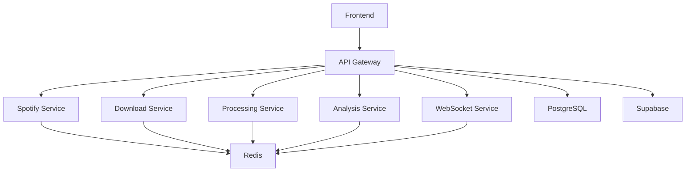

# Sound Forge Alchemy

## Version & Document Control

| Version | Date       | Author      | Description                |
|---------|------------|-------------|----------------------------|
| 1.0.0   | 2025-05-16 | peguesj     | Initial consolidated docs  |

---

## Overview

Sound Forge Alchemy is a powerful web application for audio source separation and analysis. It allows users to separate music tracks into individual stems (vocals, drums, bass, other), and perform detailed audio analysis.

- [Documentation](./docs/DOCUMENTATION.md)
- [Changelog](./CHANGELOG)

---

## Features

- Spotify playlist integration
- Audio track downloading with spotdl
- Audio source separation with Demucs
- Real-time audio analysis (BPM, key detection, and more)
- Stem visualization and playback
- Export functionality

---

## Architecture

This project uses a microservices architecture:

- **Frontend**: React + TypeScript + ShadCN UI + Vite
- **Backend Microservices**:
  - API Gateway (Node.js + Express)
  - Spotify Service (Node.js + Express)
  - Download Service (Node.js + Python + spotdl)
  - Processing Service (Node.js + Python + demucs)
  - Analysis Service (Node.js + Python + librosa/essentia)
  - WebSocket Service (Node.js + Socket.IO)
- **Infrastructure**:
  - Redis (caching, pub/sub)
  - PostgreSQL (database)
  - Supabase (auth, storage, database)

<details>
<summary>📦 <b>Microservices & Containerization (Mermaid)</b></summary>


</details>

---

## Setup and Installation

### Prerequisites

- Docker and Docker Compose
- Node.js 20+ (for local development)
- Python 3.10+ (for local development)

### Environment Variables

Copy the `.env.example` file to `.env` and update the values:

```bash
cp .env.example .env
```

Be sure to update the Spotify API credentials.

### Running with Docker

To start all services:

```bash
docker-compose up
```

This will start the frontend, backend services, and all required infrastructure.

### Local Development

To run the frontend locally:

```bash
# Install dependencies
npm install

# Start development server
npm run dev
```

For backend services, see the [backend README](backend/README.md).

---

## Usage

1. Enter a Spotify playlist URL in the input field
2. Select a track to process
3. Choose separation options (vocals, bass, drums, other)
4. Click "Separate Audio" to start processing
5. View the separated stems and visualization
6. Export the stems in your preferred format

---

## API Reference

See [docs/DOCUMENTATION.md#api-reference](./docs/DOCUMENTATION.md#api-reference) for endpoints and usage.

---

## License

MIT

## Credits

- [Demucs](https://github.com/facebookresearch/demucs) for audio source separation
- [librosa](https://librosa.org/) and [essentia](https://essentia.upf.edu/) for audio analysis
- [spotdl](https://github.com/spotDL/spotify-downloader) for Spotify track downloading