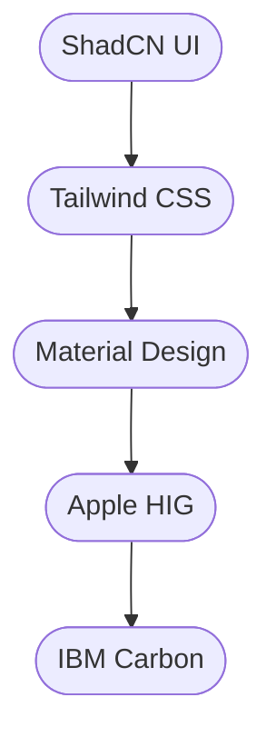
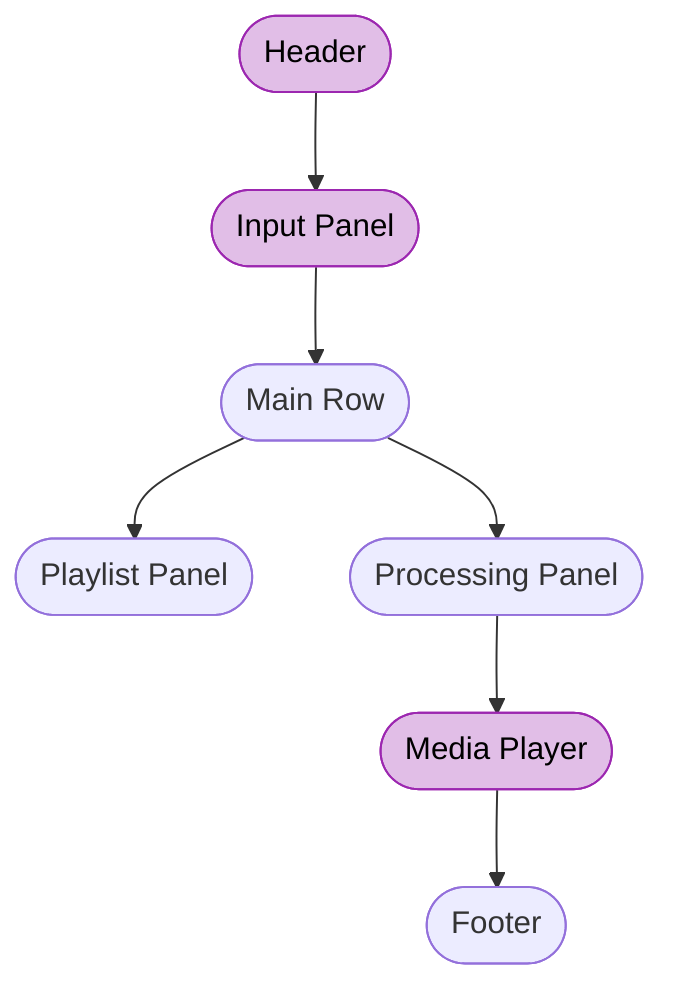
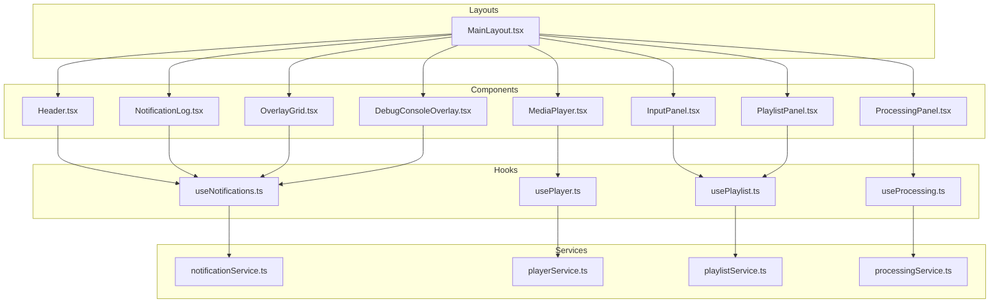

# Sound Forge Alchemy – UI/UX Design Decisions

## Version & Document Control

| Version | Date       | Author      | Description                                 |
|---------|------------|-------------|---------------------------------------------|
| 1.0.0   | 2025-05-16 | peguesj     | Initial design decisions document           |
| 1.1.0   | 2025-05-16 | peguesj     | Detailed implementation outline and standards|
| 1.2.0   | 2025-05-16 | peguesj     | Expanded explanations, color wireframes, PM table |
| 1.3.0   | 2025-05-16 | peguesj     | Added narrative, technical mapping, and interactive diagrams |

---

## Table of Contents

- [The Design Story](#the-design-story)
- [UI/UX Principles](#uiux-principles)
- [Sticky Panel Application Layout](#sticky-panel-application-layout)
- [Component Structure](#component-structure)
- [Technical Mapping: Services, Hooks, Components, Layouts](#technical-mapping-services-hooks-components-layouts)
- [Accessibility & Responsiveness](#accessibility--responsiveness)
- [Interaction & Animation](#interaction--animation)
- [Future Enhancements](#future-enhancements)
- [Implementation Roadmap](#implementation-roadmap)
- [Task Grouping for Git Commits](#task-grouping-for-git-commits)
- [References](#references)

---

## The Design Story

Sound Forge Alchemy is not just a tool—it's an experience. The design journey begins with a vision: to make advanced audio processing feel effortless, beautiful, and empowering. Every pixel, every transition, and every interaction is intentional, guided by a design system that is both modern and timeless.

Imagine a musician or audio engineer, headphones on, immersed in their creative flow. The interface should disappear, leaving only the music and the tools that shape it. Sticky panels keep controls at your fingertips, while a two-column layout balances information density with clarity. Accessibility is not an afterthought—it's a core value, ensuring everyone can participate in the creative process.

The design system is our language. We speak in the tokens of [ShadCN UI](https://ui.shadcn.com/), the utility of [Tailwind CSS](https://tailwindcss.com/), and the clarity of [Material Design](https://m3.material.io/). Our story is told through color, motion, and structure, always in service of the user.

---

## UI/UX Principles

**What:**

- These are the foundational guidelines that inform every design and implementation decision for the UI/UX. They ensure the product is visually coherent, accessible, and delightful to use.

**How:**

- By adhering to established design systems (e.g., [ShadCN UI](https://ui.shadcn.com/), [Tailwind CSS](https://tailwindcss.com/)), leveraging accessibility standards ([WAI-ARIA](https://www.w3.org/WAI/ARIA/apg/)), and using consistent feedback mechanisms (tooltips, animations).

**Why:**

- Consistency and accessibility are proven to reduce user friction, increase engagement, and make the app usable for everyone, including those with disabilities. See [Apple HIG](https://developer.apple.com/design/human-interface-guidelines/) and [IBM Carbon](https://carbondesignsystem.com/) for industry standards.

---

## Sticky Panel Application Layout

The sticky panel layout is the backbone of the Sound Forge Alchemy experience. It ensures that the most important controls and information are always within reach, no matter where you are in your workflow.

---

## Component Structure

Each part of the UI is a story in itself, with a clear role and a direct mapping to the codebase. Components are not just visual—they are interactive, accessible, and testable.

| Component         | Description                                                                 | Key Features & Resources                                                                                 |
|-------------------|-----------------------------------------------------------------------------|---------------------------------------------------------------------------------------------------------|
| Header (`Header.tsx`)            | App branding, navigation, notifications, settings/profile                   | [ShadCN Navbar](https://ui.shadcn.com/docs/components/navbar), [ARIA Navigation](https://www.w3.org/WAI/ARIA/apg/patterns/menubar/) |
| Input Panel (`InputPanel.tsx`)   | Spotify URL input, action buttons, collapsible/expandable                   | [Accessible Forms](https://www.smashingmagazine.com/2017/11/accessibility-inclusion-form-labels/), [ShadCN Input](https://ui.shadcn.com/docs/components/input) |
| Playlist Panel (`PlaylistPanel.tsx`)    | Scrollable list of tracks, sticky, highlights active track                  | [ARIA Listbox](https://www.w3.org/WAI/ARIA/apg/patterns/listbox/), [ShadCN List](https://ui.shadcn.com/docs/components/list) |
| Processing Panel (`ProcessingPanel.tsx`)  | Dynamic content, visualizations, controls, feedback                         | [Radix UI Tabs](https://www.radix-ui.com/primitives/docs/components/tabs), [ARIA Live Regions](https://www.w3.org/WAI/ARIA/apg/patterns/alert/) |
| Media Player (`MediaPlayer.tsx`)      | Sticky, always accessible, responsive                                       | [Accessible Media Player](https://www.w3.org/WAI/media/av/), [ShadCN Player](https://ui.shadcn.com/docs/components/player) |
| Overlay System (`OverlayGrid.tsx`, `DebugConsoleOverlay.tsx`, `NotificationLog.tsx`)    | Notifications, debug console, background dim/focus trap                     | [Radix UI Dialog](https://www.radix-ui.com/primitives/docs/components/dialog), [WAI-ARIA Modal](https://www.w3.org/WAI/ARIA/apg/patterns/dialog/) |

---

## Technical Mapping: Services, Hooks, Components, Layouts

The design vision is realized through a precise mapping to the codebase. Every element in the UI is backed by a service, hook, or component, ensuring a seamless and maintainable architecture.

- **Layouts**: `MainLayout.tsx` orchestrates the sticky panel structure and responsive grid.
- **Components**: Each UI region is a dedicated component, mapped 1:1 to the design.
- **Hooks**: Custom hooks like `useNotifications.ts`, `usePlayer.ts`, `usePlaylist.ts`, and `useProcessing.ts` encapsulate state and logic, ensuring separation of concerns.
- **Services**: Service modules (e.g., `notificationService.ts`) handle API calls, WebSocket events, and business logic.

For more on the backend and orchestration, see [README.docker.md](../README.docker.md) and [DOCUMENTATION.md](./DOCUMENTATION.md#architecture).

---

## Accessibility & Responsiveness

Accessibility is woven into every layer of the design. ARIA roles, keyboard navigation, and color contrast are not optional—they are essential.

- **Form Controls:** Use consistent, low-contrast backgrounds and borders for visual clarity. Large touch targets and clear focus states improve usability for all users. [Accessible Forms Guide](https://www.smashingmagazine.com/2017/11/accessibility-inclusion-form-labels/)
- **ARIA & Roles:** Proper ARIA attributes for overlays, dialogs, and notifications ensure assistive technologies can interpret the UI. [WAI-ARIA Authoring Practices](https://www.w3.org/WAI/ARIA/apg/)
- **Responsiveness:** Mobile layouts stack panels vertically, while desktop uses a 2:3 column split. Sticky elements remain accessible at all breakpoints. [Tailwind Responsive Design](https://tailwindcss.com/docs/responsive-design)
- **Future:** Add automated accessibility audits to the CI pipeline using tools like [axe](https://www.deque.com/axe/) or [Lighthouse](https://web.dev/accessibility/).

---

## Interaction & Animation

Motion is meaning. Animations are used to guide, not distract. Every transition, from a panel sliding open to a notification fading out, is designed to reinforce the user's sense of control.

- **Sticky/Collapsible Panels:** Smooth transitions for collapse/expand using CSS transitions or [Framer Motion](https://www.framer.com/motion/). Sticky positioning for header, input, and player ensures persistent access.
- **Notification Overlay:** Fade/slide-in, focus trap, and background dimming for overlays. Per-notification dismiss and unread/read state for clarity. [Radix UI Toast](https://www.radix-ui.com/primitives/docs/components/toast)
- **Tooltips:** On hover/focus for icons and controls, using [Radix UI Tooltip](https://www.radix-ui.com/primitives/docs/components/tooltip).
- **State Feedback:** Loading spinners, progress bars, and success/error animations provide clear feedback for async actions. [ShadCN Spinner](https://ui.shadcn.com/docs/components/spinner)

---

## Future Enhancements

The story continues. Planned features include:

- **Drag-and-drop reordering:** Use [React DnD](https://react-dnd.github.io/react-dnd/about) for playlist tracks.
- **Advanced accessibility:** Add screen reader live regions and support for reduced motion preferences.
- **Theming:** Support dark/light mode and user preferences using [Tailwind Theming](https://tailwindcss.com/docs/theme) or [Radix Colors](https://www.radix-ui.com/colors).
- **Granular state management:** Use [Zustand](https://zustand-demo.pmnd.rs/) or [Redux Toolkit](https://redux-toolkit.js.org/) for per-panel loading/error states.
- **Expanded overlay system:** Add overlays for help, chat, and other tools as needed.

---

## Implementation Roadmap

The journey from vision to reality is mapped in clear, actionable steps. Each step is a chapter in the story of Sound Forge Alchemy's evolution.

| Step | Task Group | Description | Resources | Example Commit |
|------|------------|-------------|-----------|---------------|
| 1    | Layout & Structure | Refactor `MainLayout.tsx` for sticky header, input, two-column, sticky player, footer | [CSS Sticky](https://css-tricks.com/position-sticky-2/), [Tailwind Layout](https://tailwindcss.com/docs/layout) | feat(layout): implement sticky panel layout |
| 2    | UI Consistency & Design System | Audit and refactor all UI elements for design system consistency | [ShadCN UI](https://ui.shadcn.com/), [Tailwind CSS](https://tailwindcss.com/) | style(ui): refactor for design system |
| 3    | Notification & Toaster Parity | Centralize notification state, sync toaster and list, add dismiss controls | [Radix Toast](https://www.radix-ui.com/primitives/docs/components/toast), [Ant Design Notification](https://ant.design/components/notification/) | feat(notifications): centralize and sync notifications |
| 4    | Accessibility & Responsiveness | Ensure focus states, ARIA roles, keyboard navigation, color contrast, screen reader support | [WAI-ARIA](https://www.w3.org/WAI/ARIA/apg/), [WebAIM Contrast](https://webaim.org/resources/contrastchecker/) | a11y: improve accessibility |
| 5    | Animation & Feedback | Add smooth transitions, animate notifications, loading/progress indicators | [Framer Motion](https://www.framer.com/motion/), [Material Motion](https://m3.material.io/styles/motion/overview) | feat(animation): add panel and notification animations |
| 6    | Testing & QA | Unit/integration tests for layout, notifications, accessibility; manual QA; accessibility audit | [Jest](https://jestjs.io/), [axe](https://www.deque.com/axe/), [Lighthouse](https://web.dev/accessibility/) | test: add tests for layout and notifications |
| 7    | Documentation & Changelog | Update docs, diagrams, changelog as features are implemented | [Markdown Guide](https://www.markdownguide.org/), [Mermaid Diagrams](https://mermaid.js.org/) | docs: update documentation and changelog |

---

## Task Grouping for Git Commits

- **feat(layout):** Implement sticky header, input panel, two-column layout, sticky media player, and footer
- **style(ui):** Refactor form controls and UI elements for design system consistency
- **feat(notifications):** Centralize notification state, sync toaster and notification list, add dismiss controls
- **a11y:** Improve accessibility (focus, ARIA, keyboard, color contrast)
- **feat(animation):** Add/adjust animations for panels, notifications, and overlays
- **test:** Add tests for notification sync, layout, and accessibility
- **docs:** Update documentation, diagrams, and changelog

---

## References

- [README.md](../README.md)
- [DOCUMENTATION.md](./DOCUMENTATION.md)
- [README.docker.md](../README.docker.md)
- [ShadCN UI](https://ui.shadcn.com/)
- [Tailwind CSS](https://tailwindcss.com/)
- [Material Design](https://m3.material.io/)
- [Apple HIG](https://developer.apple.com/design/human-interface-guidelines/)
- [IBM Carbon](https://carbondesignsystem.com/)
- [Radix UI Toast](https://www.radix-ui.com/primitives/docs/components/toast)
- [Ant Design Notification](https://ant.design/components/notification/)
- [WAI-ARIA APG](https://www.w3.org/WAI/ARIA/apg/)
- [WebAIM Contrast Checker](https://webaim.org/resources/contrastchecker/)
- [Dribbble](https://dribbble.com/)
- [Mobbin](https://mobbin.com/)

For implementation details, see [DOCUMENTATION.md](./DOCUMENTATION.md) and [ARCHITECTURE.md](./ARCHITECTURE.md).
