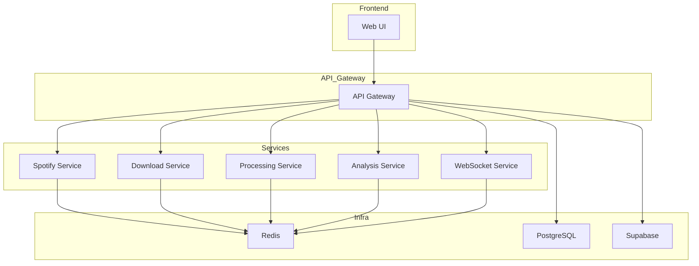
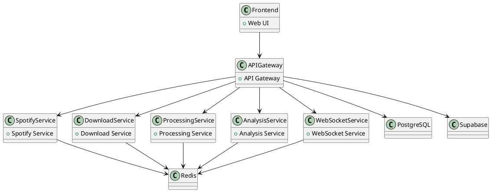
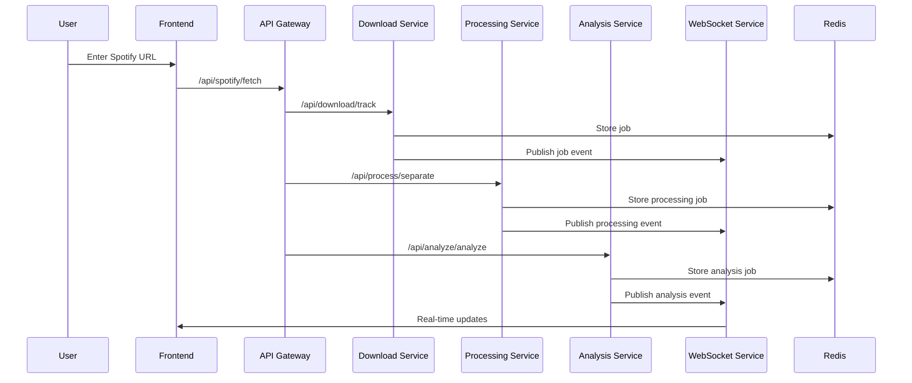
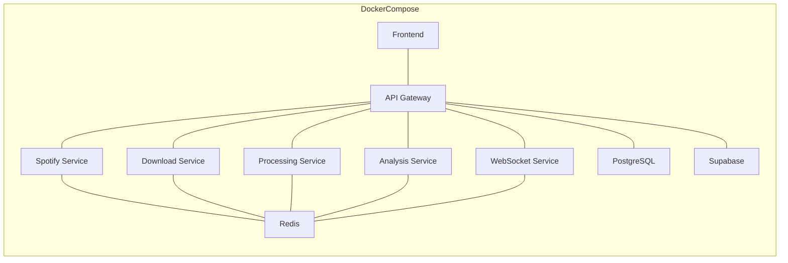
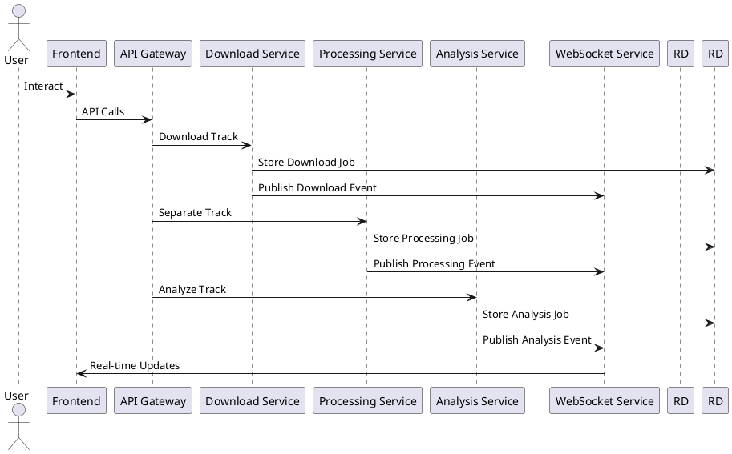

# Sound Forge Alchemy Documentation

## Version & Document Control

| Version | Date       | Author      | Description                |
|---------|------------|-------------|----------------------------|
| 1.0.0   | 2025-05-16 | peguesj     | Initial consolidated docs  |

---

# Table of Contents
- [Sound Forge Alchemy Documentation](#sound-forge-alchemy-documentation)
  - [Version \& Document Control](#version--document-control)
- [Table of Contents](#table-of-contents)
  - [Overview](#overview)
  - [Architecture](#architecture)
  - [Microservices](#microservices)
  - [Containerization](#containerization)
  - [Data Flow](#data-flow)
  - [API Reference](#api-reference)
  - [Setup \& Installation](#setup--installation)
  - [Usage](#usage)
  - [Diagrams](#diagrams)
  - [Changelog](#changelog)
  - [Next Steps \& Future Enhancements](#next-steps--future-enhancements)

---

## Overview

Sound Forge Alchemy is a microservices-based web application for audio source separation and analysis. It enables users to split music tracks into stems (vocals, drums, bass, other), analyze audio, and interact with a modern UI.

📊 <b>Architectural Diagram (Mermaid)</b>

---

## Architecture

- **Frontend**: React + TypeScript + ShadCN UI + Vite
- **Backend Microservices**: Node.js, Python, Express, spotdl, demucs, librosa, essentia
- **Infrastructure**: Redis, PostgreSQL, Supabase

🗺️ <b>Microservices Architecture (PlantUML)</b>

---

## Microservices

- **API Gateway**: Entry point, routes requests
- **Spotify Service**: Spotify API integration
- **Download Service**: Downloads tracks using spotdl
- **Processing Service**: Separates audio using demucs
- **Analysis Service**: Audio analysis (BPM, key, etc.)
- **WebSocket Service**: Real-time updates

🔄 <b>Process Flow (Mermaid)</b>

---

## Containerization

- **Docker Compose** for orchestration
- **Base Images**: node-base, python-node-base, gpu-base
- **Volumes**: audio_data, models, etc.
- **Networks**: sound-forge-network

🐳 <b>Containerization Architecture (Mermaid)</b>

---

## Data Flow

🔁 <b>Data Flow (PlantUML)</b>

---

## API Reference

See [API Reference](#api-reference) in the root README for endpoints and usage.

---

## Setup & Installation

See [README.md](../README.md) for setup, prerequisites, and installation instructions.

---

## Usage

See [README.md](../README.md) for usage instructions.

---

## Diagrams

See above for embedded diagrams. For advanced diagrams, see [ARCHITECTURE.md](ARCHITECTURE.md).

---

## Changelog

See [../CHANGELOG](../CHANGELOG) for a full list of changes.

---

## Next Steps & Future Enhancements

- Add advanced model management UI
- Enhance notification and settings UX
- Add more audio analysis features
- Improve container orchestration for cloud
- Add more diagrams and documentation
- Expand test coverage
- Add user authentication and permissions
- Integrate with more music services

---

For more details, see the [README.md](../README.md) and [ARCHITECTURE.md](ARCHITECTURE.md).
